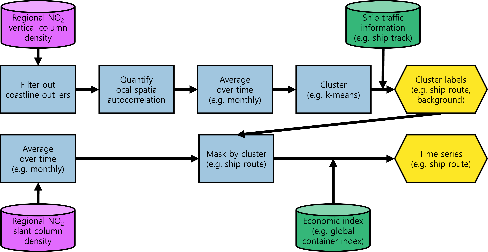

# TROPOMI_NO2_clustering

This repository contains notebook implementations of the original paper: "A Systematic Approach to Identify Shipping Emissions Using Spatio-Temporally Resolved TROPOMI Data"

Jupyter Notebook containing Python codes and results for TROPOMI NO2 clustering.
It is an end-to-end notebook with demonstration of the spatio-temporal data preprocessing and clustering on TROPOMI NO2 measurement.
For brevity of presentation, the notebook displays the analysis result tested on the Red Sea region.

## Preliminary
Before running the notebook, one needs to download the [TROPOMI NO2 column density dataset](https://data.4tu.nl/articles/_/16943725).

## Schematic representation

## Input Data
The used data are listed below.

1. Regional NO2 vertical / slant column density

    In this study, TROPOMI NO2 column data on three test regions are used.
    For the regridded TROPOMI NO2 datasets, please refer to the following link: [TROPOMI NO2 column density dataset](https://data.4tu.nl/articles/_/16943725). They are available in netCDF file format.
   
    - The dataset contains the processed data of open-source level-2 TROPOMI NO2 measurements on the Mediterranean Sea area, the Red Sea, and the Indian Ocean, publicly available via the Copernicus S5P hub (https://s5phub.copernicus.eu) and retrieved by TROPOspheric Monitoring Instrument (TROPOMI) on board the Copernicus Sentinel-5 Precursor satellite.
    - The dataset is regridded, day-averaged, and provided by Airbus Defence and Space Netherlands. That is, all irregularly gridded L2 data is interpolated on a regular grid defined in World Geodetic System 1984 (WGS84). In addition, if the same measurement pixel is available with valid data from a different point in time on the same day, the result contains multiple contributes of the same weight but with different scaled values, such that time averaging is performed as well.
    - The dataset has four variables: nitrogendioxide_tropospheric_column; nitrogendioxide_tropospheric_column_precision; nitrogendioxide_slant_column_density; nitrogendioxide_slant_column_density_precision.
    - Each variable is constructed in three dimensions: Time; Latitude; Longitude.

2. Ship traffic information

    In this study, ship track count data is used for spatial validation. They are available in NumPy array file format.
    
    - The original ship track count data is published by Halpern et al. Spatial and temporal changes in cumulative human impacts on the world’s ocean spatial validation, *Nature Communications* **2015**, *6*, 7615. [https://doi.org/10.1038/ncomms8615](https://doi.org/10.1038/ncomms8615)
    - The original ship track count data freely available at [doi:10.5063/F19Z92TW](https://doi.org/10.5063/F19Z92TW).
    - Regridded ship track count data are stored in NumPy array and separately stored per test region (the Mediterranean Sea area, the Red Sea, and the Indian Ocean).

3. Economic index
    
    In this study, the Global Container Throughput Input Index is used for the temporal validation. They are available in Microsoft Excel format, published by  the Leibniz-Institut für Wirtschaftsforschung and the Institute of Shipping Economics and Logistics (RWI/ISL).
    
    - It is available from the webpage of Institute of Shipping Economics and Logistics: [RWI/ISL Container Throughput Input Index: Revival of global trade](https://www.isl.org/en/containerindex/april-2023).
    - One does not need to download the file in the local, since it is directly fetched by the notebook file while running using the downloadable link provided by the webpage.    
    
## Outputs
Notebook file contains the corresponding outputs in line. In summary, the notebook displays:

1. Plots from base & mask map, NO2 data contour map to spatially processed clustered NO2 data contour map.
2. Plots and quantifications from statistical analyses.
3. Plots and quantifications from spatial and temporal validation.
